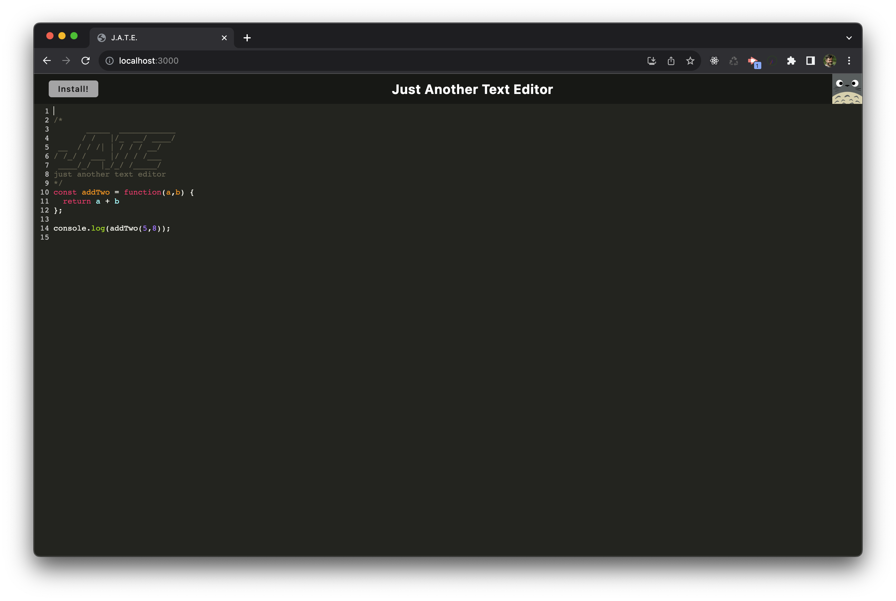
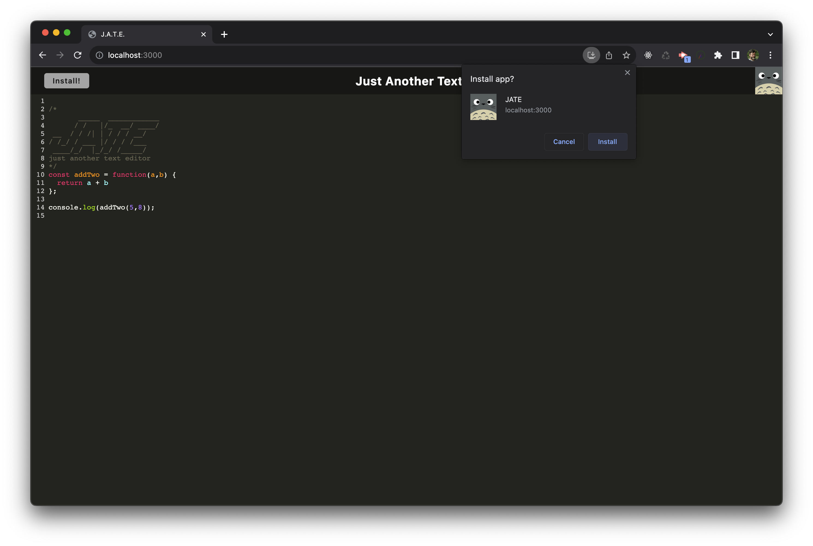
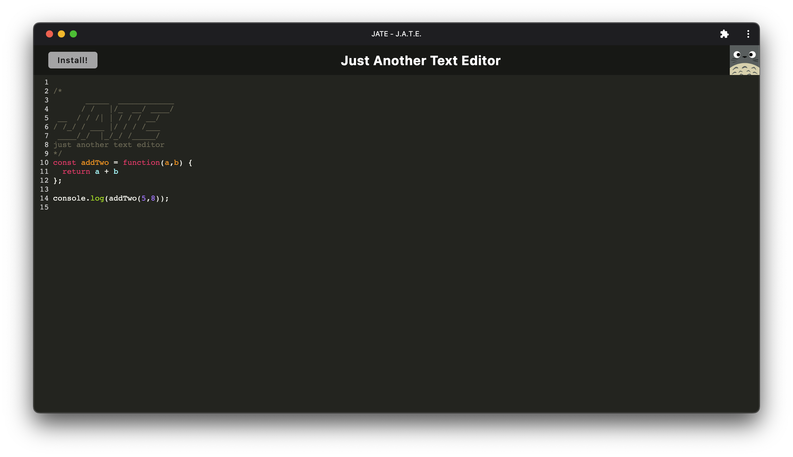

# J.A.T.E. - Just Another Text Editor

## Description
A text editor that runs in the browser. This app is a single-page application that meets the PWA criteria.

## What it should look like:

## Installation
N/A

## License
MIT

## GitHub
GitHub Repository: https://github.com/skywalkah/PWA-text-editor

## Deployed Application
Application: https://fast-hamlet-98043-b16aa05f192d.herokuapp.com/